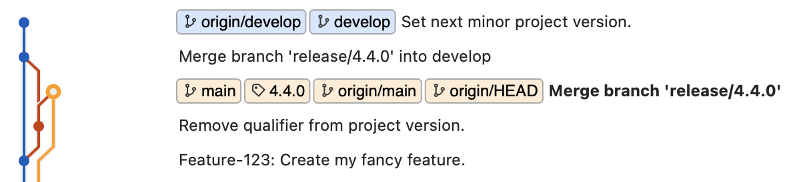

# Gitflow-CLI

[](https://github.com/mercedes-benz/gitflow-cli/actions/workflows/build-and-test.yml)

Gitflow is a branching model that organizes feature development, releases, and hotfixes into dedicated branches, 
providing a structured approach for managing complex software projects with routine release timelines.

The **gitflow-cli** automates release workflow process, saving considerable time and reducing the risk of errors. 
It keeps your Git graph clean and consistent, enhancing project stability through semantic versioning.



## Installation

From within the project directory the **gitflow-cli** can be built, run and installed.

1. **Clone the repository:**

    ```bash
    git clone https://github.com/mercedes-benz/gitflow-cli.git
    cd gitflow-cli
    ```

2. **Install the application:**

   To install and run the application, use the following commands:

   ```bash
   go install
   gitflow-cli --help
   ```

   **Note:** Make sure you have [Go](https://go.dev/doc/install) installed and that the `go/bin` directory is part of your PATH.

## Usage

### Release:

To initiate a new `release/x.y.z` branch from `develop`, use the following command:

   ```bash
   gitflow-cli release start
   ```

You can now use the `release/x.y.z` branch for bug fixing, creating the release changelog, 
or even deploying your product on a staging environment. Once the release is ready, finish it with:

   ```bash
   gitflow-cli release finish
   ```

### Hotfix:

To initiate a new `hotfix/x.y.z` branch from `main`, use the following command:

   ```bash
   gitflow-cli hotfix start
   ```

Check out the `hotfix/x.y.z` branch, create a quick patch, and push your changes. Then, finish the hotfix with:

   ```bash
   gitflow-cli hotfix finish
   ```

## Plugin Architecture

Since each project type has a different structure (e.g. variations in where the version number is stored, etc.), 
the **gitflow-cli** automatically detects the project context and delegates command execution to the appropriate plugins. 

Currently, the following plugins are available:

* **maven**
    * Workflow for [maven](https://maven.apache.org) projects
    * Requires a `pom.xml` file in the root directory

* **standard**
    * Workflow for projects without a designated technology
    * Requires a `version.txt` file in the root directory
    * Currently not implemented, but can be used as a template for additional plugins

## Configuration

   You have the option to provide a configuration file to **gitflow-cli**.
   This configuration file will be automatically located at `HOME/.gitflow-cli.yaml` and has the following structure:

   ```yaml
   core:
     production: main | custom-name                        # production branch name
     development: develop | custom-name                    # development branch name
     release: release | custom-name                        # release branch prefix
     hotfix: hotfix | custom-name                          # hotfix branch prefix
     undo: true | false                                    # rollback local changes in case of an error, default = false
     logging: stderr | stdout | cmdline | output | off     # diagnostic logging for the Gitflow workflow, default = stdout | cmdline | output
   ```

   You can also specify a custom configuration file using the top-level flag `--config file-path`.

## Contributing

We welcome any contributions.
If you want to contribute to this project, please read the [contributing guide](CONTRIBUTING.md).

### Git Hook

To contribute to **gitflow-cli**, we suggest setting up the Git hook below to comply with our contribution guidelines.

   ```bash
   cp .githooks/prepare-commit-msg .git/hooks/
   chmod +x .git/hooks/prepare-commit-msg
   ```

## Code of Conduct

Please read our [Code of Conduct](CODE_OF_CONDUCT.md) as it is our base for interaction.

## License

This project is licensed under the [MIT LICENSE](LICENSE).

## Provider Information

Please visit <https://www.mercedes-benz-techinnovation.com/en/imprint/> for information on the provider.

Notice: Before you use the program in productive use, please take all necessary precautions,
e.g. testing and verifying the program with regard to your specific use.
The source code has been tested solely for our own use cases, which might differ from yours. 
