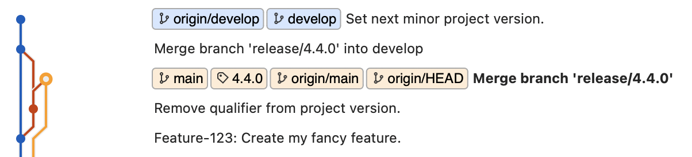

# Gitflow-CLI

[](https://github.com/mercedes-benz/gitflow-cli/actions/workflows/build.yml)
[](https://github.com/mercedes-benz/gitflow-cli/actions/workflows/blackduck.yml)

Gitflow is a [branching model](https://nvie.com/posts/a-successful-git-branching-model/) that organizes feature development, 
releases, and hotfixes into dedicated branches, providing a structured approach to managing complex software projects with
reliable releases based on [semantic versioning](https://semver.org/).

The **gitflow-cli** automates this release workflow process, saving time and reducing the risk of errors. 
It maintains a clean and consistent Git graph, contributing to overall project stability.



## Installation

From within the project directory the **gitflow-cli** can be built, run and installed.

1. **Clone the repository:**

    ```bash
    git clone https://github.com/mercedes-benz/gitflow-cli.git
    cd gitflow-cli
    ```

2. **Install the application:**

   To install and run the application, use the following commands:

   ```bash
   go install
   gitflow-cli --help
   ```

   **Note:** Make sure you have [Go](https://go.dev/doc/install) installed and that the `go/bin` directory is part of your PATH.

### Prerequisites

- **git** — required for all operations
- **docker** — optional. Used when `--docker-mode` flag is set, or as automatic fallback when a native plugin tool is missing (see [Plugin Execution Modes](#plugin-execution-modes)). Install [Docker Desktop](https://docs.docker.com/get-docker/) or Docker Engine.

## Usage

Before using **gitflow-cli**, either navigate to your target Git repository or specify it with the `--path` flag.
Make sure the repository meets all [preconditions](#preconditions).

### Release

To initiate a new release, use the following command:

   ```bash
   gitflow-cli release start
   ```

Release start will perform the following steps:

* Create a new release branch from `develop` (e.g., `release/1.2.0`)
* Remove the version qualifier in the version file (e.g., `1.2.0-dev` → `1.2.0`)

You can now use the `release/x.y.z` branch for bug fixing, creating the release changelog, or deploying your app to your testing environment.

Once the release is ready, finish it with:

   ```bash
   gitflow-cli release finish
   ```

Release finish will perform the following steps:
* Merge the `release/x.y.z` branch into `main` (e.g., `release/1.2.0` → `main`)
* Create a tag in `main` with the corresponding version (e.g., `1.2.0`)
* Perform a back-merge into `develop` (e.g., `release/1.2.0` → `develop`)
* Bump the development version to the next minor version (e.g., `1.3.0-dev`)

### Hotfix

Use hotfixes if you have a bug in production, and you need to make targeted fixes to `main` branch without deploying pending changes from `develop`.

To initiate a new hotfix, use the following command:

   ```bash
   gitflow-cli hotfix start
   ```

Hotfix start will perform the following steps:
* Create a `hotfix/x.y.z` branch from `main` (e.g., `hotfix/1.2.1`)
* Set the patch version in the version file (e.g., `1.2.0` → `1.2.1`)

You can now check out the `hotfix/x.y.z` branch, create a quick patch, and push your changes.

Once the hotfix is ready, finish it with:

   ```bash
   gitflow-cli hotfix finish
   ```

Hotfix finish will perform the following steps:
* Merge the `hotfix/x.y.z` branch into `main` (e.g., `hotfix/1.2.1` → `main`)
* Create a tag in `main` with the corresponding version (e.g., `1.2.1`)
* Perform a back-merge into `develop` (e.g., `hotfix/1.2.1` → `develop`)
* Keep the current version in `develop` unchanged (e.g., `1.3.0-dev`)

## Preconditions

To use **gitflow-cli**, ensure your project meets the basic structural requirements, particularly around Git branches and version management.

### Git Branches

Your repository must define a dedicated **production** and **development** branches (e.g., `main` and `develop`).
These can be [customized](#configuration) as needed.

### Version File

Each project type may store version information in a different location.
The **gitflow-cli** detects your project's context and automatically delegates tasks to the appropriate plugin based on the presence of specific file.

#### Available Plugins

| Plugin       | Description                                                                                      | Required File                                 |
|--------------|--------------------------------------------------------------------------------------------------|-----------------------------------------------|
| **standard** | Plugin for projects without a dedicated version file.                                            | `version.txt`                                 |
| **mvn**      | Plugin for [maven](https://maven.apache.org) projects.                                           | `pom.xml`                                     |
| **npm**      | Plugin for [npm](https://www.npmjs.com/) projects.                                               | `package.json`                                |
| **python**   | Plugin for [python](https://www.python.org/) projects.                                           | `pyproject.toml`, `setup.cfg`, or `setup.py`  |
| **composer** | Plugin for [composer](https://getcomposer.org/) projects.                                        | `composer.json`                               |
| **road**     | Plugin for projects with road app manifest configuration.                                        | `road.yaml`                                   |

By default, all plugins execute commands **natively** on the host. If a required CLI tool (e.g., `mvn`, `npm`, `composer`, `toml`) is not installed, the CLI automatically falls back to running the command inside a Docker container. You can also force a specific mode with `--docker-mode` or `--native-mode`.

**Note:** If no technology-specific plugin can be applied, **gitflow-cli** will create a `version.txt` file in your project's root directory and apply the **standard** plugin.

## Configuration

A configuration file is automatically created at `$HOME/.gitflow-cli.yaml` on first run. You can also specify a custom path with `--config`.

### Configuration Reference

| Config key | Description | CLI flag | Default |
|------------|-------------|----------|---------|
| `branches.production` | Name of the production branch | — | `main` |
| `branches.development` | Name of the development branch | — | `develop` |
| `branches.release` | Prefix for release branches | — | `release` |
| `branches.hotfix` | Prefix for hotfix branches | — | `hotfix` |
| `workflow.push` | Push changes to remote after workflow completes | `--no-push` (disables) | `true` |
| `workflow.rollback` | Rollback local changes on workflow failure | — | `false` |
| `workflow.docker-fallback` | Automatically use Docker when native tool is missing | — | `true` |
| `logging` | Diagnostic output (combinable: `stdout`, `stderr`, `cmdline`, `output`, `off`) | — | `off` |

**Priority:** CLI flag > config file > default value.

`--docker-mode` and `--native-mode` are mutually exclusive.

### Example Configuration

   ```yaml
   branches:
     production: main
     development: develop
     release: release
     hotfix: hotfix

   workflow:
     push: true
     rollback: false
     docker-fallback: true

   logging: "off"
   ```

### Plugin Execution Modes

   All plugins support two execution modes:

   - **native-mode** (default): Commands run directly on the host. The respective CLI tool (e.g., `mvn`, `npm`, `composer`, `toml`) must be installed and available in PATH.
   - **docker-mode**: Commands run inside a disposable Docker container. Only `docker` needs to be installed on the host. Containers are removed automatically after each invocation (`--rm`).

   The execution mode is resolved in the following priority order:
   1. CLI flag: `--docker-mode` or `--native-mode` (applies to all plugins)
   2. Docker fallback (default: enabled): If the native tool is missing, Docker is used automatically. Disable with `docker-fallback: false` in config.
   3. Interactive: If the native tool is missing and docker-fallback is disabled, the CLI asks whether to use Docker (auto-confirmed with `--yes`)
   4. Default: `native-mode`

## Contributing

We welcome any contributions.
If you want to contribute to this project, please read the [contributing guide](CONTRIBUTING.md).

### Git Hook

To contribute to **gitflow-cli**, we suggest setting up the Git hook below to comply with our contribution guidelines.

   ```bash
   cp .githooks/prepare-commit-msg .git/hooks/
   chmod +x .git/hooks/prepare-commit-msg
   ```

## Code of Conduct

Please read our [Code of Conduct](CODE_OF_CONDUCT.md) as it is our base for interaction.

## License

This project is licensed under the [MIT LICENSE](LICENSE).

## Provider Information

Please visit <https://www.mercedes-benz-techinnovation.com/en/imprint/> for information on the provider.

Notice: Before you use the program in productive use, please take all necessary precautions,
e.g. testing and verifying the program with regard to your specific use.
The source code has been tested solely for our own use cases, which might differ from yours.
